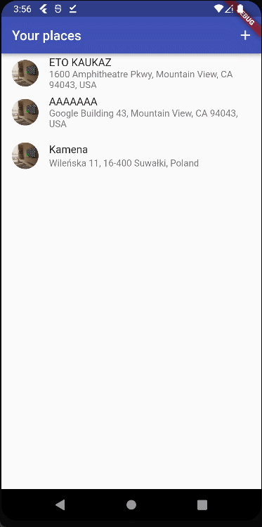

# camera_and_location_use

It is the simple app, which uses native devices futures as camera, maps and location. The data are saved on the device by **SQLite**.  It was created in **Flutter** framework.

## Table of Contents
* [App Features](#app-features)
* [Presentation](#presentation)
* [Packages used in project](#packages-used-in-project)
* [Project Status](#project-status)
* [Sources](#sources)
* [Contact](#contact)

## App Features
- Sign Up by Email, Password and Username. 
- Add image of user. 
- Login Using Email and Password. 
- Send mesasages. 
- Read messages. 
- View of users image. 
- Pushnotification when messages are received.  

## Presentation

>On the first screen we have saved all "great places" with title, photo and address. By clicking on a given "great place" we have a screen with an enlarged photo and the ability to view it on a map. We can add more "great places" by clicking the add icon. In the add screen, we enter the title, take picture and choose one of two methods to add the location (select on map or current location).
## Packages used in project:
- [SQFLite](https://pub.dev/packages/sqflite)
- [Image Picker](https://pub.dev/packages/image_picker)
- [Path Provider](https://pub.dev/packages/path_provider)
- [Path](https://pub.dev/packages/path)
- [Http](https://pub.dev/packages/http)
- [Location](https://pub.dev/packages/location)
- [Location Platform Interface](https://pub.dev/packages/location_platform_interface)
- [Location Web](https://pub.dev/packages/location_web)
- [Google Maps Flutter](https://pub.dev/packages/google_maps_flutter)
  
  
## Project Status
The project is completed. 

## Sources
The application was created during the course Flutter & Dart - The Complete Guide [2022 Edition] by Maximilian Schwarzmüller from Academind.

## Contact
Created by [@dbrzek](mailto:brzek.damian@gmail.com) - feel free to contact me!
